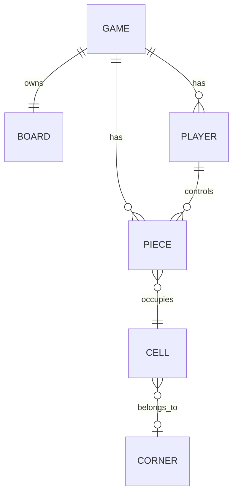

# 欢乐跳棋 - ERD

## 1. 核心模型



## 2. Game

```text
- board: Board
- players: Player[]
- pieces: Piece[]
- currentPlayerIndex: number
- selectedPiece: Piece | null
- validMoves: Move[]
- jumpChain: JumpStep[]
- rankings: number[]
- gameOver: boolean
- config: { playerCount, aiDifficulty }
```

`playerCount` 表示人类玩家设置。1 人局会自动补 1 个 AI 控制者。

## 3. Board

```text
- cells: Cell[]
- cellById: Map<number, Cell>
- cellByCoord: Map<string, Cell>
- offset: { x, y }
```

职责：

- 根据 `BOARD_DATA.cells` 初始化 121 格棋盘
- 维护 `Cell.piece`
- 生成单步移动和跳跃移动
- 将 axial 坐标转换为 Canvas 像素坐标

## 4. Cell

```text
- id: number
- q: number
- r: number
- corner: number | null
- piece: Piece | null
```

编号规则：

- 中央区：1-61
- 角0：62-71
- 角1：72-81
- 角2：82-91
- 角3：92-101
- 角4：102-111
- 角5：112-121

## 5. Player

```text
- id: number
- seats: number[]
- isAI: boolean
- difficulty: "easy" | "medium" | "hard"
- color: string
- pieces: Piece[]
- name: string
```

说明：

- `Player` 是控制者。
- `seats` 是该控制者拥有的角区列表。
- 一个玩家可以控制多个角区。
- `isFinished` 由全部棋子是否进入各自目标角派生。

## 6. Piece

```text
- id: number
- playerId: number
- seatId: number
- cellId: number
```

说明：

- `playerId` 表示控制者。
- `seatId` 表示棋子的起点角区。
- 目标角通过 `getTargetCorner(seatId)` 派生。
- 同一玩家控制多个角区时，不同棋子的目标角可能不同。

## 7. Move

```text
- type: "move" | "jump"
- cellId: number
- via?: number
- path: number[]
```

当前实现逐跳执行。单步移动后结束回合；跳跃后若仍有跳跃目标，玩家可以继续跳跃，也可以主动结束回合。

## 8. Seat Assignment

座位分配由 `getSeatAssignments(controllerCount, seatsPerPlayer)` 统一产生。

有效组合要求：

```text
controllerCount * seatsPerPlayer <= 6
```

开始页中，1 人局会自动补 1 个 AI 控制者，所以玩家选择 1 人时 `controllerCount = 2`。

当前显式分配：

```text
2x1: [[0], [3]]
2x2: [[0,1], [3,4]]
2x3: [[0,1,2], [3,4,5]]
3x1: [[0], [1], [2]]
3x2: [[0,3], [1,4], [2,5]]
4x1: [[0], [1], [3], [4]]
5x1: [[0], [1], [2], [3], [4]]
6x1: [[0], [1], [2], [3], [4], [5]]
```

*最后更新：2026-05-15*
